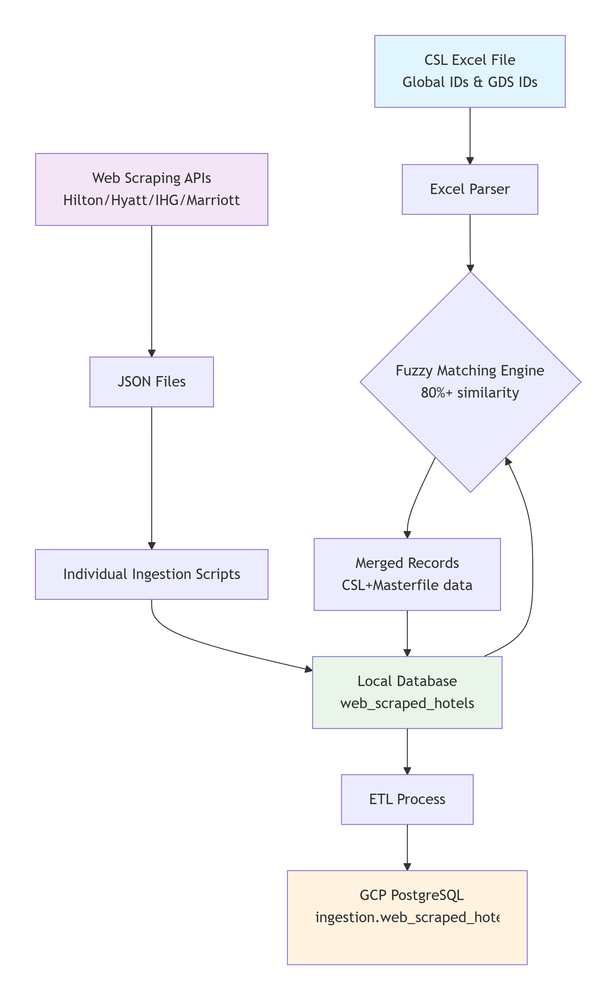

## 📋 Overview
This project implements a **comprehensive hotel data integration and masterfile system** that processes hotel information from multiple heterogeneous sources—**Excel files, JSON scrapers, and existing databases**—into a **single unified PostgreSQL master database**.

The system is designed to:
- Match hotels across sources using **intelligent fuzzy matching**
- Normalize inconsistent data into **standardized schemas**
- Merge chain-specific attributes (especially **pet policies & fees**)
- Perform **robust ETL pipelines** with incremental updates and audit tracking

The final output is a **production-ready, query-optimized hotel masterfile** suitable for analytics, APIs, and downstream integrations.





**Description**
- Authoritative CSL master list
- Provides standardized global identifiers for hotel properties

**Key Fields**
- `Global Property ID`
- `Chain Code` (HY, HI, etc.)
- `Hotel Name`
- `Address`
- `Latitude / Longitude`

---

### 2️⃣ Web-Scraped Hotel Chains (`localdb_ingestion/`)

| Chain     | Format | Highlights |
|----------|--------|------------|
| Hilton   | JSON   | Pet policies, amenities, ratings |
| Hyatt    | JSON   | Detailed pet fee structures |
| IHG      | JSON   | Comprehensive property metadata |
| Marriott | JSON   | Structured pet policies & deposits |

---

### 3️⃣ Existing Database (`web_scraped_hotels`)

- Pre-existing scraped hotel data
- Includes:
  - `hotel_code`
  - `chain_code`
  - Address & geo data
  - Pet policies (raw & structured)

---

## ⚙️ Processing Components

### 🔍 1. Fuzzy Matching Engine (`mapping_with_csl.py`)

**Purpose**
Match CSL Excel hotels with existing database records.

**Algorithm**
- `RapidFuzz.token_sort_ratio`
- Default threshold: **≥ 80%**

**Enhancements**
- Country-based pre-filtering
- Chain code bonus (+5 for HY / HI)
- Normalized name comparison
- Multi-pass matching strategy

---

### 🧼 2. Data Normalization Pipeline

**Name Normalization**
- Lowercasing
- Special character removal
- Whitespace cleanup

**Phone Standardization**
- Digits-only extraction
- Country-agnostic format

**Geographic Standardization**
- State & country code normalization

**Pet Policy Parsing**
- Converts free-text into structured fields
- Detects:
  - Fees
  - Deposits
  - Weight limits
  - Allowed pet types

---

### 🆔 3. Hotel Code Generation Strategy

| Source     | Pattern | Example |
|-----------|--------|---------|
| CSL Excel | Global Property ID | `123456` |
| Hilton    | Counter + Original | `5000-HILTON123` |
| IHG       | Counter + Original | `1500-IHG456` |
| Marriott  | Counter + Chain + Original | `1000-MAR-789` |

Guarantees **uniqueness**, **traceability**, and **source awareness**.

---

### 🔄 4. ETL Pipeline (`etl_kruiz.py`)

**Extract**
- Reads from local PostgreSQL `web_scraped_hotels`

**Transform**
- INT4 overflow detection
- NULL standardization
- JSON serialization & validation
- Data type coercion

**Load**
- Inserts into **GCP PostgreSQL**
- Target table: `ingestion.web_scraped_hotel`
- Uses `ON CONFLICT DO UPDATE`

---

## 🗄 Database Schema

### 📍 Primary Table: `web_scraped_hotel`

#### Core Hotel Info
- `hotel_code` (PK)
- `chain_code`
- `name`
- `address_line_1`, `address_line_2`
- `city`, `state`, `country`, `postal_code`
- `full_address`
- `latitude`, `longitude`
- `phone_number`, `fax_number`

#### Quality & Ratings
- `sabre_rating`
- `property_quality_type`
- `property_style_description`

#### 🐾 Pet Policies (Structured)
- `is_pet_friendly`
- `pet_policy`
- `allowed_pet_types`
- `weight_limit`
- `max_pets`
- `has_pet_friendly_rooms`
- `breed_restrictions`

#### 💰 Pet Fees
- `pet_fee_night`
- `pet_fee_total_max`
- `pet_fee_deposit`
- `pet_fee_currency`
- `pet_fee_interval`
- `pet_fee_variations`
- `has_pet_deposit`
- `is_deposit_refundable`

#### 🏨 Amenities & Extras
- `pet_amenities`
- `parking`
- `nearby_parks`
- `parks_distance_miles`
- `links` (JSON)
- `description`
- `primary_airport_code`

#### 🧾 Audit & Tracking
- `source`
- `is_verified`
- `verification_type`
- `created_at`
- `updated_at`
- `last_updated`

---

## 🎯 Key Features

### 🧠 Intelligent Matching
- Multi-pass fuzzy matching
- Geographic awareness
- Chain-specific weighting

### 🧪 Data Quality Enforcement
- INT overflow protection
- Strict NULL handling
- Phone normalization
- JSON schema validation

### 🔁 Incremental Updates
- Timestamp-based change detection
- Conflict-safe upserts
- Full audit trail

### 🏷 Chain-Specific Parsers
- **Hilton** – Free-text pet policy analysis
- **Hyatt** – Fee & interval extraction
- **IHG** – Amenity & restriction parsing
- **Marriott** – Deposit & refund logic

---

## 📁 Project Structure

```text
hotel-masterfile-system/
├── kruiz_ingestion/              # GCP Data Ingestion Layer
│   └── etl_kruiz.py              # Main ETL script for processing web_scraped_hotels
│
├── localdb_ingestion/           # Local Database Ingestion Layer
│   ├── hilton_ingestion.py      # Hilton hotels JSON → Local DB
│   ├── hyatt_ingestion.py       # Hyatt hotels JSON → Local DB
│   ├── ihg_ingestion.py         # IHG hotels JSON → Local DB
│   └── marriott_ingestion.py    # Marriott hotels JSON → Local DB
│
├── mapped_with_csl/             # CSL Mapping & Matching Layer
│   └── mapping_with_csl.py      # Fuzzy matching: CSL Excel ↔ Database records
│
└── README.md                    # Project documentation


## 🚀 How to Run

```bash
# Step 1: Map CSL with existing data
python mapping_with_csl.py

# Step 2: Run ETL pipeline
python etl_kruiz.py
